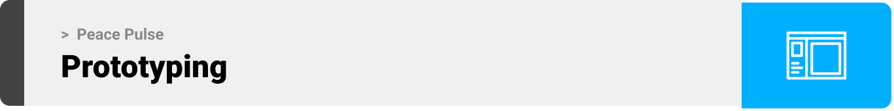
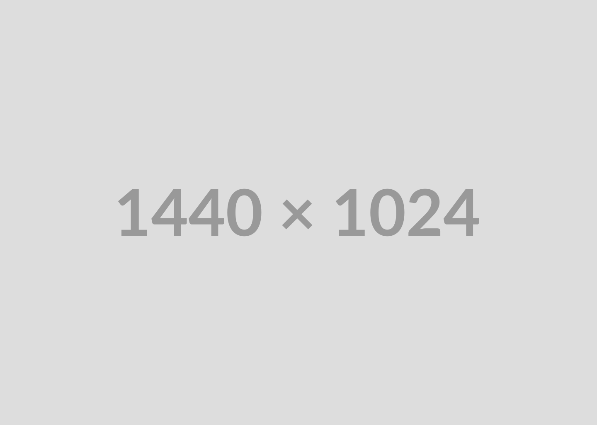
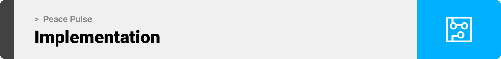

<!-- project philosophy -->


> A mobile app that guides you in your mental health journey.
>
> Peace Pulse, your dedicated mental health companion. Our app seamlessly connects you with the ideal psychiatrist through advanced matchmaking algorithms, considering your preferences and therapeutic needs. Engage in transformative video sessions supported by Face Emotional Detection AI, offering real-time insights into your emotional state. Receive personalized daily tips and resources tailored to your mental health journey, while also benefiting from a compassionate community of like-minded individuals. Trained volunteers are available to offer empathetic support during challenging moments. Track your progress with personalized dashboards and collaborate with your psychiatrist to set and achieve goals

### User Stories
- As a user, I want a space where I can talk about my problems.
- As a user with anxiety, I want the app to send me daily reminders to practice mindfulness exercises and provide quick access to calming resources when I feel overwhelmed.
- As a user, I want help for time management and tasks
- As a user experiencing stress, I want the app to offer guided relaxation exercises and breathing techniques to help me manage and reduce stress levels.
- As a user with mental health condition and  interested in mental health education, I want the app to provide articles, videos, and content that explains psychological concepts.
- As a user dealing with depression, I want the app to offer mood tracking features, allowing me to log my emotions and identify patterns over time.
- As a therapist, I want the app to have secure communication channels for virtual sessions with my clients, ensuring confidentiality and convenience.

<br><br>

<!-- Prototyping -->


> We designed Peace Pulse using wireframes and mockups, iterating on the design until we reached the ideal layout for easy navigation and a seamless user experience.

### Wireframes
| Login screen  | Register screen |  Landing screen |
| ---| ---| ---|
|  |  |  |

### Mockups
| Home screen  | Menu Screen | Order Screen |
| ---| ---| ---|
|  |  |  |

<br><br>

<!-- Implementation -->


> Using the wireframes and mockups as a guide, we implemented Peace Pulse app with the following features:

### User Screens (Mobile)
| Login screen  | Register screen | Landing screen | Loading screen |
| ---| ---| ---| ---|
|  |  |  |  |
| Home screen  | Menu Screen | Order Screen | Checkout Screen |
|  |  |  |  |

### Admin Screens (Web)
| Login screen  | Register screen |  Landing screen |
| ---| ---| ---|
|  |  |  |
| Home screen  | Menu Screen | Order Screen |
|  |  |  |

<br><br>

<!-- Tech stack -->


###  Coffee Express is built using the following technologies:

- This project uses the [Flutter app development framework](https://flutter.dev/). Flutter is a cross-platform hybrid app development platform which allows us to use a single codebase for apps on mobile, desktop, and the web.
- For persistent storage (database), the app uses the [Hive](https://hivedb.dev/) package which allows the app to create a custom storage schema and save it to a local database.
- To send local push notifications, the app uses the [flutter_local_notifications](https://pub.dev/packages/flutter_local_notifications) package which supports Android, iOS, and macOS.
  - 🚨 Currently, notifications aren't working on macOS. This is a known issue that we are working to resolve!
- The app uses the font ["Work Sans"](https://fonts.google.com/specimen/Work+Sans) as its main font, and the design of the app adheres to the material design guidelines.

<br><br>

<!-- How to run -->


> To set up Coffee Express locally, follow these steps:

### Prerequisites

This is an example of how to list things you need to use the software and how to install them.
* npm
  ```sh
  npm install npm@latest -g
  ```

### Installation

_Below is an example of how you can instruct your audience on installing and setting up your app. This template doesn't rely on any external dependencies or services._

1. Get a free API Key at [https://example.com](https://example.com)
2. Clone the repo
   ```sh
   git clone https://github.com/your_username_/Project-Name.git
   ```
3. Install NPM packages
   ```sh
   npm install
   ```
4. Enter your API in `config.js`
   ```js
   const API_KEY = 'ENTER YOUR API';
   ```

Now, you should be able to run Coffee Express locally and explore its features.